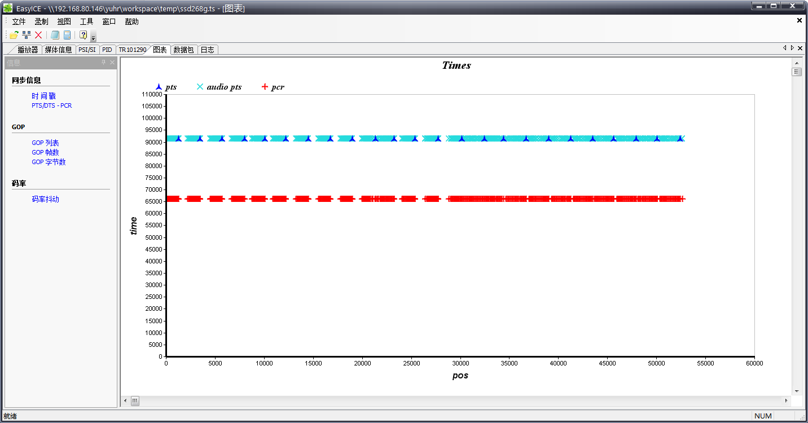
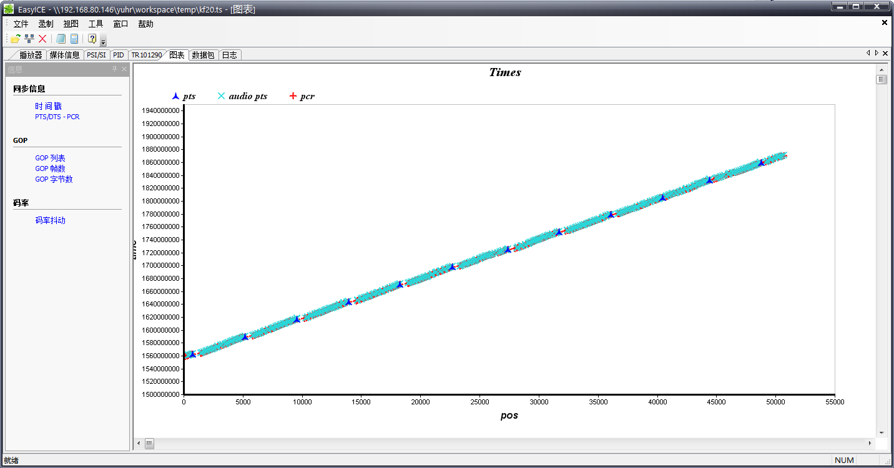

从某芯片平台推流srt时，使用vlc拉流需要更改 vlc配置，将 mpegts 分流器配置中的 “信任串流内的 PCR” 选项取消勾选才能正常播放，否则只会播放第一帧。最终排查发现是时间戳问题导致。

<!-- more -->

### 1. 问题现象 

从某芯片平台推流srt时，使用vlc拉流需要更改 vlc配置，将 mpegts 分流器配置中的 “信任串流内的 PCR” 选项取消勾选才能正常播放，否则只会播放第一帧

### 2. 问题分析

1. 首先问题出在 mpegts 流打包上，这一部分由 ffmpeg 内部实现

通过保存下来设备上打包出的 ts 流，使用 EasyICE 工具进行分析，可以看到，pcr和pts离得很远



PCR 是用于校准 PTS 的，正常情况下 PCR 与 PTS 应该非常近才对，如下图为正常的mpetgs流



因此需要分析 PCR 是怎么生成的
ffmpeg 中负责编码mpegts流的模块为 libavformat/mpetgsenc.c 
通过阅读其源代码可以发现，初始 PCR = PTS * 300，而后每个分片增加固定值

```cpp
    if (!ts->first_dts_checked && dts != AV_NOPTS_VALUE) {
        ts->first_pcr += dts * 300;
        ts->first_dts_checked = 1;
    }

static int64_t get_pcr(const MpegTSWrite *ts)
{
    return av_rescale(ts->total_size + 11, 8 * PCR_TIME_BASE, ts->mux_rate) +
           ts->first_pcr;
}
```

而在发送PCR时，又会将其表示为300的倍数与模数（即除300的余数）

```cpp
static int write_pcr_bits(uint8_t *buf, int64_t pcr)
{
    int64_t pcr_low = pcr % 300, pcr_high = pcr / 300;

    *buf++ = pcr_high >> 25;
    *buf++ = pcr_high >> 17;
    *buf++ = pcr_high >>  9;
    *buf++ = pcr_high >>  1;
    *buf++ = pcr_high <<  7 | pcr_low >> 8 | 0x7e;
    *buf++ = pcr_low;

    return 6;
}
```

那么再回来看刚刚流中解析出来的一个PCR与PTS同步包

PCR:1786247237240
PTS:8244806682

PCR是明显小于PTS*300的，可以断定在乘300时发生了溢出行为导致除300无法还原

打印一下喂给mpegts的时间戳

```txt
write c:1 d:348 t:6999570809744578056
write c:0 d:6795 t:6999570809744566538
write c:1 d:345 t:6999570809744599399
write c:0 d:6250 t:6999570809744583202
write c:2 d:1708 t:6999570809744599863
write c:0 d:13335 t:6999570809744599863
write c:1 d:350 t:6999570809744620740
write c:0 d:6176 t:6999570809744616530
write c:1 d:344 t:6999570809744642065
write c:2 d:1951 t:6999570809744633192
write c:0 d:7998 t:6999570809744633192
write c:1 d:349 t:6999570809744663396
write c:0 d:5457 t:6999570809744649858
write c:2 d:1385 t:6999570809744666523
```

可以看到非常大，已经接近int64的极限，*300直接溢出了

### 3. 确定修复方法

先确认调整时间戳可以解决问题，将给进ffmpeg的时间戳减去一个固定值
可以看到流就正常了

但是这样流播久了仍然会溢出，需要看看mpegts本身是怎么处理溢出的
```cpp
static void write_pts(uint8_t *q, int fourbits, int64_t pts)
{
    int val;

    val  = fourbits << 4 | (((pts >> 30) & 0x07) << 1) | 1;
    *q++ = val;
    val  = (((pts >> 15) & 0x7fff) << 1) | 1;
    *q++ = val >> 8;
    *q++ = val;
    val  = (((pts) & 0x7fff) << 1) | 1;
    *q++ = val >> 8;
    *q++ = val;

}


static int write_pcr_bits(uint8_t *buf, int64_t pcr)
{
    int64_t pcr_low = pcr % 300, pcr_high = pcr / 300;

    *buf++ = pcr_high >> 25;
    *buf++ = pcr_high >> 17;
    *buf++ = pcr_high >>  9;
    *buf++ = pcr_high >>  1;
    *buf++ = pcr_high <<  7 | pcr_low >> 8 | 0x7e;
    *buf++ = pcr_low;

    return 6;
}
```
可以看到 pts 只保留了低 33bit，而且pcr_high也是 33bit，它们会同时溢出保证一致
那么我们给到 ffmpeg 的时间戳也只需要保留低 33bit 即可

> 注意，保留位数的行为应在时间戳时钟转换为mpeg-ts时钟之后
> mpeg-ts的时钟基准为 1/90000 秒
