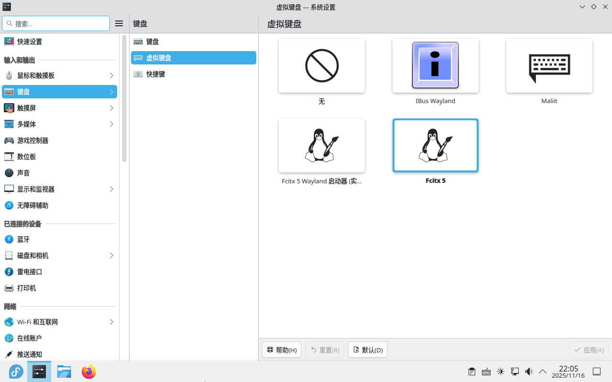
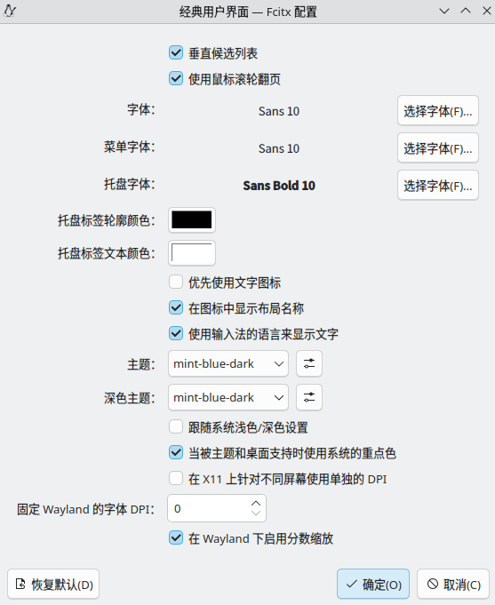

Win 10 已经结束了支持，但是我不想升级到Win11，因此决定将主力机切换到Linux。
在试用了多个发行版后，最终决定使用 Fedora Silverblue。
此文记录了一些初步设置过程，主要是 **显卡驱动** 和 **输入法** 。

<!-- more -->

## 为什么选用 Fedora Silverblue

1. 整体较新，每半年一个大版本，社区活跃，包丰富
2. 使用 原子更新 作为底层特性的发行版，这样的发行版更为稳定、不用折腾，且完全由包管理器和flatpak管理，减少心智负担
3. Wayland 对于远程桌面的支持很烂，我需要切换到 X11，后续切换到 Cinnamon 桌面，其使用 GTK 生态，因此从 GNOME 切换过去问题更少
4. 提供 Nvidia 驱动源, 安装驱动很方便

## 安装系统

下载镜像并扔进 [Ventory](https://www.ventoy.net/cn/download.html)。

按照基本安装流程安装系统即可。

为了后续维护方便，我使用了两块NVME硬盘。
在安装时，使用了一块 500GB 的硬盘作为根文件系统，所有分区配置使用默认，保证最好的兼容性。

在安装完成后，将一块 2TB 硬盘格式化为 btrfs，并将 /@/home 子卷挂载到 /home。
这样我可以随意重置根文件系统，且在Home下的常用数据不用迁移（比如说steam安装的游戏等）。

::: tip
建议安装为英文，然后安装完成后再更改为中文。
这样，默认的Home文件夹下的各个文件夹的名称都是英文，再终端中使用更加方便。

**修改路径：**
+ 系统设置(System Settings) > 区域和语言(Region and Language) > 语言(Language) > 修改(Modify) 改为简体中文
::: 

::: tip
在使用原子模式系列的Fedora中，包管理工具为 `rpm-ostree` 而非 `dnf`
另外，推荐使用 `flatpak` 安装大型应用，如 Steam 等，而非直接安装进系统
:::

::: important
在同一次启动内安装的所有包都会合并到一个原子操作中，并在重启后提交进变动
因此建议在按功能分块安装包、并适当重启
:::

::: important
如果需要快速滚回，在启动时的Grub界面切换到 `ostree:1` 即可滚回一个原子节点
:::

## 安装一些基础维护工具

```bash
sudo rpm-ostree install --idempotent git vim neovim curl wget zsh fastfetch btop ncdu autofs
```
完成后重启即可

## 挂载 Home

将安装完成的 /home 目录迁移到另一块硬盘上，便于重装系统

> 在以下命令中，
>  + 新硬盘为 /dev/sdb
>  + 用户名为 philogag

1. 不用分区，直接将全盘格式化为 btrfs
sudo mkfs.btrfs -f /dev/sdb

2. 创建子卷
```bash
sudo mkdir /mnt/sdb
sudo mount /dev/sdb /mnt/sdb
sudo btrfs subvolume snapshot -r /home /mnt/home.snap
sudo btrfs send /mnt/home.snap | sudo btrfs receive /mnt/sdb/
sudo btrfs subvolume snapshot /mnt/sdb/home.snap /mnt/sdb/home
sudo btrfs subvolume delete /mnt/home.snap
sudo btrfs subvolume delete /mnt/sdb/home.snap
sudo umount /mnt
```

3. 配置挂载
使用 `ls /dev/disk/by-uuid -l | grep sdb` 获取分区的 UUID
修改 /etc/fstab
注释掉原有的/home挂载
并在末尾添加新的挂载
```fstab
UUID=c5de8f77-53b5-4450-9e06-07e3c80dfd12 /home btrfs subvol=home,compress=zstd:1 0 0
```

而后更新系统
```bash
sudo systemctl daemon-reload
sudo mount -a
```

重启后检查 `df /home` 显示为 /dev/sdb 即为切换成功

::: tip
当挂载失败导致循环卡死在启动界面时，可以通过进入救援模式修改fstab
1. 引导进入安装iso镜像
2. 选择 Troubleshooting > Rescue a Fedora system
3. 等待救援系统启动完毕
4. 选择救援模式为 3) Skip to shell
5. 挂载安装盘中的第三个分区到 /mnt/sysimage
    + `mount /dev/sda3 /mnt/sysimage`
6. 进入 /mnt/sysimage/root/ostree/deploy/fedora/deploy, 当中有四个文件夹
    + 分别为 `aaaa.0`/`aaaa.0.origin`/`bbbb.0`/`bbbb.0.origin` 其中 aaaa与bbbb即为新旧两次安装的迭代
7. 修改其中的 aaaa.0/etc/fstab 和 bbbb.0/etc/fstab 回退更改
8. reboot 重启即可
:::

## 安装 Nvidia 显卡驱动

> 参考文档 https://rpmfusion.org/Howto/NVIDIA

安装 基础驱动、Cuda支持、编解码支持和Vulkan

```bash
sudo rpm-ostree install --idempotent akmod-nvidia xorg-x11-drv-nvidia-cuda xorg-x11-drv-nvidia-cuda-libs vulkan
sudo rpm-ostree kargs --append=rd.driver.blacklist=nouveau,nova_core --append=modprobe.blacklist=nouveau,nova_core
```

结束后重启即可

## 安装输入法

### 1. 安装
```bash
sudo rpm-ostree install --idempotent fcitx5 fcitx5-rime librime-lua
```
安装完成后重启即可

### 2. 开启自动激活输入法框架

编辑 /etc/environment
添加 
```
GTK_IM_MODULE=fcitx5
QT_IM_MODULE=fcitx5
XMODIFIERS=@im=fcitx5
```

进入 系统设置 -> 开机自启动程序 -> 添加 -> Fcitx5


### 3. 配置 rime，使用 rime-ice

使用 [[雾凇拼音]](https://github.com/iDvel/rime-ice)

```bash
cd ~/.local/share/fcitx5
mv rime rime.bak
git clone https://github.com/iDvel/rime-ice rime --depth=1
echo -e "patch:\n  schema_list:\n    - schema: rime_ice" > rime/default.custom.yaml
```

::: tip
如果rime无法重新部署，可以重启fcitx5
:::

### 5. 配置 fcitx5 皮肤

使用 [[薄荷输入法 同款fcitx5皮肤]](https://github.com/witt-bit/fcitx5-theme-mint)

```bash
cd ~/.local/share/fcitx5
mkdir themes
git clone https://github.com/witt-bit/fcitx5-theme-mint.git --depth 1
cp -r fcitx5-theme-mint/mint-* ./themes
rm fcitx5-theme-mint -rf
```

打开 Fcitx5配置 > 附加组件 > 经典用户界面
  + 勾选 “垂直候选列表”
  + 将 主题 和 “深色主题” 选为 mint-green-dark



## 基础美化

1. 换一个背景

2. 安装字体

> 用户级字体应放置在 `~/.local/share/fonts`

选择额外安装 FiraCode Nerd Font 作为开发字体和终端字体
将 ttf 下载并置入 `~/.local/share/fonts`


