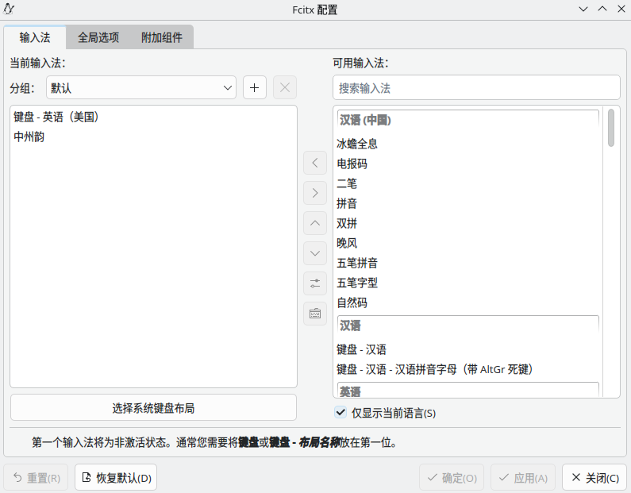

Win 10 已经结束了支持，但是我不想升级到Win11，因此决定将主力机切换到Linux。
在试用了多个发行版后，最终决定使用 Fedora Kinoite。
此文记录了一些初步设置过程，主要是 **显卡驱动** 和 **输入法** 。

<!-- more -->

## 为什么选用 Fedora Kinoite

1. 我希望使用 原子更新 作为底层特性的发行版，这样的发行版更为稳定、不用折腾
2. 不喜欢Gnome，因此选择原生带KDE的发行版

这样一来，选择只剩下了 Fedora 和 OpenSUSE。

4. OpenSUSE 系列: 
    + 优点：
        + 整体较为稳定，滚动发行版包也较新；
        + 与KDE关联最为密切，适配度最好
        + 提供Nvidia驱动源，安装驱动很方便
        + 默认提供 Wayland 和 X11 会话
    + 缺点：
        + 社区不活跃，包比较匮乏，且国内镜像更新不及时，容易产生bug
        + 滚动过快，可能bug较多；
        + Slowroll 版本仍未进入主要发行，支持度更加匮乏
        + 且 Slowroll 不支持LiveOS，在只有NV显卡的电脑上无法进入安装界面；而我又不想先装 Tumbleweed 再更新为 Slowroll

最终还是选择 [**Fedora Kinoite**](https://fedoraproject.org/atomic-desktops/kinoite/)

+ 整体较新，每半年一个大版本，社区活跃，包丰富
+ 支持原子更新，根目录挂载为只读模式，更稳定和省心
+ 原生提供 KDE 镜像安装
+ 提供 Nvidia 驱动源
+ 默认仅提供 Wayland 会话

## 安装系统

下载镜像并扔进 [Ventory](https://www.ventoy.net/cn/download.html)。

按照基本安装流程安装系统即可。

为了后续维护方便，我使用了两块NVME硬盘。
在安装时，使用了一块 500GB 的硬盘作为根文件系统，所有分区配置使用默认，保证最好的兼容性。

在安装完成后，将一块 2TB 硬盘格式化为 btrfs，并将 /@/home 子卷挂载到 /home。
这样我可以随意重置根文件系统，且在Home下的常用数据不用迁移（比如说steam安装的游戏等）。

::: tip
建议安装为英文，然后安装完成后再更改为中文。
这样，默认的Home文件夹下的各个文件夹的名称都是英文，再终端中使用更加方便。

**修改路径：**
+ 系统设置(System Settings) > 区域和语言(Region and Language) > 语言(Language) > 修改(Modify) 改为简体中文
::: 

::: tip
在使用原子模式系列的Fedora中，包管理工具为 `rpm-ostree` 而非 `dnf`
另外，推荐使用 `flatpack` 安装大型应用，如 Steam 等，而非直接安装进系统
::: 

::: important
在同一次启动内安装的所有包都会合并到一个原子操作中，并在重启后提交进变动
因此建议在按功能分块安装包、并适当重启
:::

::: important
如果需要快速滚回，在启动时的Grub界面切换到 `ostree:1` 即可滚回一个原子节点
:::

## 安装 Nvidia 显卡驱动

> 参考文档 https://rpmfusion.org/Howto/NVIDIA

安装 基础驱动、Cuda支持、编解码支持和Vulkan

```bash
sudo rpm-ostree install --idempotent akmod-nvidia xorg-x11-drv-nvidia-cuda xorg-x11-drv-nvidia-cuda-libs vulkan
sudo rpm-ostree kargs --append=rd.driver.blacklist=nouveau,nova_core --append=modprobe.blacklist=nouveau,nova_core
```

结束后重启即可

## 安装基础工具

```bash
sudo rpm-ostree install --idempotent git neovim curl wget zsh fastfetch jq
```
安装完成后重启即可

## 安装输入法

### 1. 安装
```bash
sudo rpm-ostree install --idempotent fcitx5 fcitx5-rime librime-lua
```
安装完成后重启即可

### 2. 开启自动激活输入法框架
进入 系统设置 -> 键盘 -> 虚拟键盘 -> 选择 "Fcitx 5" 并保存


### 3. 启用 rime (中州韵)

+ 打开 Fcitx5配置 > 输入法
+ 将"中州韵"添加到左侧


### 4. 配置 rime，使用 rime-ice

使用 [[雾凇拼音]](https://github.com/iDvel/rime-ice)

```bash
cd ~/.local/share/fcitx5
mv rime rime.bak
git clone https://github.com/iDvel/rime-ice rime --depth=1
echo -e "patch:\n  schema_list:\n    - schema: rime_ice" > rime/default.custom.yaml
```

::: tip
如果rime无法重新部署，可以尝试注销重新登录
:::

### 5. 配置 fcitx5 皮肤

使用 [[薄荷输入法 同款fcitx5皮肤]](https://github.com/witt-bit/fcitx5-theme-mint)

```bash
cd ~/.local/share/fcitx5
mkdir themes
git clone https://github.com/witt-bit/fcitx5-theme-mint.git --depth 1
cp -r fcitx5-theme-mint/mint-* ./themes
rm fcitx5-theme-mint -rf
```

打开 Fcitx5配置 > 附加组件 > 经典用户界面
  + 勾选 “垂直候选列表”
  + 将 主题 和 “深色主题” 选为 mint-green-dark


